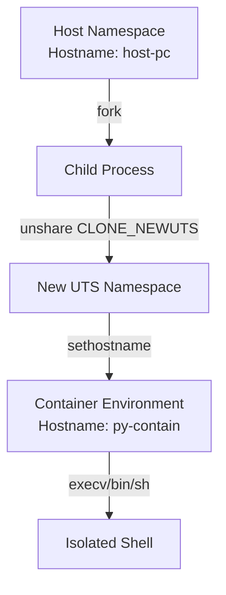
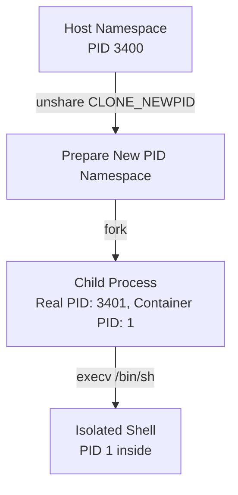
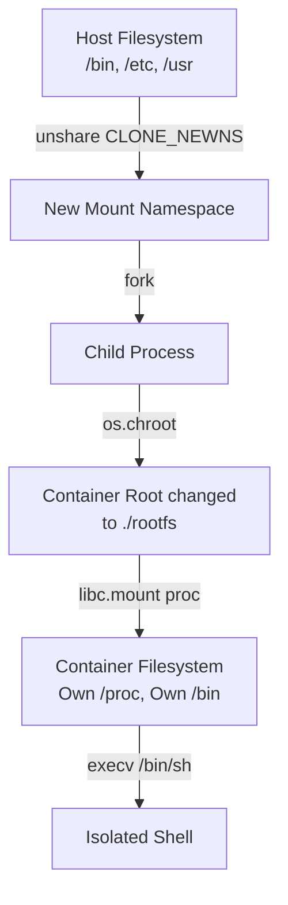

# Python Docker from Scratch

Building a container from scratch using Python, divided into 5 learning levels based on "Rubber-Docker" concepts.

## Level 0: Fork & Exec (Foundation)
This level demonstrates the foundational concept of Linux processes: how a new process is created and how it can execute a different program.

### Architecture Diagram
```mermaid
graph TD;
    A[Parent Process<br>os.fork()] -->|child_pid == 0| B(Child Process)
    A -->|child_pid > 0| C(Parent waits with os.wait)
    B -->|os.execv<br>('/bin/sh')| D[New Program: 'sh']
    D -->|Exit| C
```

### Lessons Learned
- **Forking**: `os.fork()` creates a nearly identical copy of the calling process but doesn't actually copy all memory immediately. It uses "copy-on-write" (CoW) to be highly efficient. It returns `0` in the child process and the child's ID in the parent.
- **Executing**: `os.execv()` replaces the memory space, code, and data of the current process with a new program (in this case, `/bin/sh`). The process ID remains exactly the same, but the executable changes.
- **Kernel Level Context**: When the kernel handles `fork()`, it allocates new entries in the process table and duplicates the necessary task structures (`task_struct` in Linux). When it handles `exec()`, the kernel discards the cloned memory mappings and loads the new executable's memory sections (text, data, bss) from the filesystem. This two-step mechanism (`fork` + `exec`) is the Unix philosophy for process creation, allowing process environment manipulation (like file descriptors and eventually Namespaces/Cgroups) *between* the fork and the exec phase. This is the exact moment where containers hook in to apply isolation!

## Level 1: UTS Namespace (Hostname Isolation)
UTS (UNIX Time-sharing System) namespaces isolate two system identifiers: `nodename` and `domainname` — primarily what we know as the "hostname". By giving a container its own UTS namespace, modifying the hostname from inside the container doesn't alter the main host networking identity.

### Architecture Diagram


### Lessons Learned
- **Namespaces Core Concept**: These are a Linux Kernel feature that partitions kernel resources. One group of processes sees one set of resources, while another group sees a totally different set. It's the illusion of a dedicated machine!
- **unshare() System Call**: This is how we literally detach the current process from the default main namespace and spin up a new isolated one. We hook into the C library's `unshare` via `ctypes`.
- **Privilege Matters**: Calling `unshare` for UTS and trying to change the hostname requires root access (specifically the `CAP_SYS_ADMIN` capability). Without `sudo`, the kernel outright denies the request to prevent malicious programs from messing with network identities.

## Level 2: PID Namespace (Process Isolation)
PID (Process ID) namespaces isolate the process ID number space. This means that processes inside a container won't see the processes of the host machine (like systemd, your browser, etc.). Inside the container, the first process will believe it is `PID 1`.

### Architecture Diagram


### Lessons Learned
- **The Magic of PID 1**: In Linux, PID 1 has special duties (like adopting orphaned processes). When we create a new PID namespace, the first process inside it gets PID 1.
- **Why unshare *before* fork?**: For the PID namespace specifically, `unshare(CLONE_NEWPID)` doesn't move the calling process into the new namespace (because you can't change your own PID on the fly without breaking things). Instead, it dictates that the *next* child created via `fork` will be born into the new namespace and become PID 1.
- **Security & Privacy**: Without PID isolation, a container process could send signals (like `kill`) to host processes! Isolating PID namespaces stops this entirely.

## Level 3: Mount & Chroot (Filesystem Isolation)
Filesystem isolation is what makes a container feel like a completely separate machine with its own OS files (like Alpine, Ubuntu, etc.). 

### Architecture Diagram


### Lessons Learned
- **Mount Namespaces (`CLONE_NEWNS`)**: This was actually the very first namespace added to Linux (hence the generic name `NEWNS`). It ensures that mounting or unmounting a device inside the container does not affect the host machine.
- **Chroot Jail**: We use `os.chroot()` to change the "apparent root" of the filesystem for the current process. Once `chroot` is called, the process cannot see or access files outside of the designated directory (e.g., `./rootfs`). It thinks `./rootfs` is the actual `/`.
- **The /proc magic**: Linux stores process information in a virtual filesystem called `/proc`. Tools like `ps` read from here. By mounting a fresh `/proc` inside our new mount namespace, `ps` will only see the processes existing within our PID namespace. This ties Level 2 and Level 3 together!
